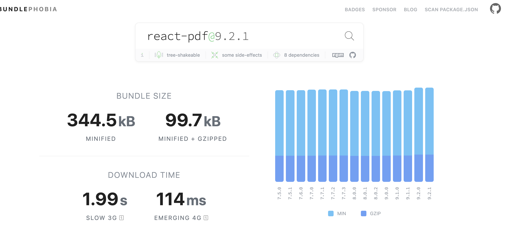
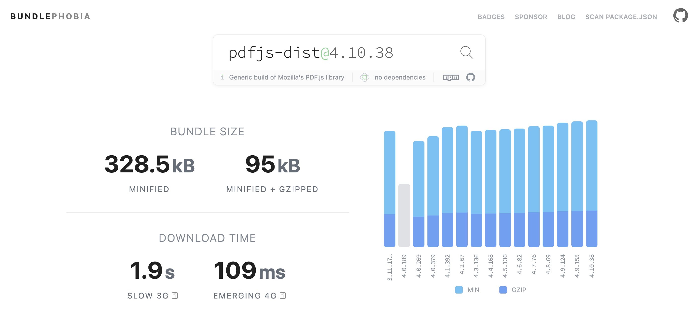

## Objetivo: 
- solucionar a visualização dos pdfs para webview mobile
- Para rodar o projeto teste: npm run dev

## Solução:
- A estratégia adotada foi transformar o arquivo pdf em imagem. Fiz um projeto exemplo fazendo um upload de pdf e transformando em **dataUrl** para depois converter em imagem.

Utilizei 2 libs essa solução:

 - [react-pdf](https://react-pdf.org/)
 - [pdfjs](https://github.com/mozilla/pdf.js)

## Diferenças:

**Obs: A implementação é exatamente igual, já que o React-pdf é contruido usando o pdfJs**: 

Podemos usar o WebWorker de duas formas:

- via CDN [react-pdf](./src/reactPdf/pdfViewer.tsx)
- via interna [pdf.js](./src/pdfjs/pdfViewerPdfJs.tsx)

**REACT-PDF**
- React-pdf foi a lib utilizada no projeto que usei de referência
- tem componentes react que poderiam ajudar a visualição do pdf caso fosse necessário (vide documentação)

  
**PDF.JS**
- Projeto mantido pela Mozilla, com uma comunidade grande e documentação extensa.
- Mais genérico, podendo ser usado em qualquer projeto JavaScript.
- Pode consumir mais recursos ao renderizar PDFs grandes ou complexos.

## Visualização do projeto de testes

